# [SQL](https://sqlbolt.com/)

[Proof of Completion](#proof-of-completion)

---

## Syntax

All info scraped from [sqlbolt](https://sqlbolt.com/)

```sql
/*Complete SELECT query*/
SELECT DISTINCT column, AGG_FUNC(column_or_expression), …
FROM mytable
    JOIN another_table
      ON mytable.column = another_table.column
    WHERE constraint_expression
    GROUP BY column
    HAVING constraint_expression
    ORDER BY column ASC/DESC
    LIMIT count OFFSET COUNT;
```

- `SELECT DISTINCT col, other_col` remove duplicate rows, but it does this indescriminately.
- `ORDER BY` will sort alphanumerically based on column value
- `LIMIT` caps how many results
- `OFFSET` tells where to start the search

---

## Multi Table Query and JOIN

### Normalization

Database normalization is important because minimizes duplicate data in a single table, it also allows data to grow independantly from each other.

```sql
SELECT column, another_table_column, …
FROM mytable
/*LEFT keeps rows from A regardless if they exist in b and Right does b regardless of a. FULL KEEPS IT ALL! May also see it as LEFT OUTER JOIN (Kept for compatibility)*/
INNER/LEFT/RIGHT/FULL JOIN another_table 
/*This matches rows from the first table and the second table which have the same key (as defined by the ON constraint) to create a result row with the combined columns */
    ON mytable.id = another_table.id
WHERE condition(s)
ORDER BY column, … ASC/DESC
LIMIT num_limit OFFSET num_offset;
```

### Checking for Null

Sometimes we need to check for null values, it's always good to reduce the amount, but sometimes that iusn't possible.

A good idea is to have data type appropriate place holder values.

`WHERE column IS/IS NOT NULL`

### Queries with Expressions

Each database has a select number of supported maths that can ba applied to atable entries, (Check the Docs)

The use of expressions can save time and extra post-processing of the result data, but can also make the query harder to read, so we recommend that when expressions are used in the SELECT part of the query, that they are also given a descriptive alias using the AS keyword. (Otherwise the label of the col will be the expression)

### Aggregate Functions

Syntax: `SELECT AGG_FUNCT(column or expression) as Descriptor, ...`

- `COUNT(*), COUNT(column)` A common function used to counts the number of rows in the group if no column name is specified. Otherwise, count the number of rows in the group with non-NULL values in the specified column.
- `MIN(column)` Finds the smallest numerical value in the specified column for all rows in the group.
- `MAX(column)` Finds the largest numerical value in the specified column for all rows in the group.
- `AVG(column)` Finds the average numerical value in the specified column for all rows in the group.
- `SUM(column)` Finds the sum of all numerical values in the specified column for the rows in the group.

- `GROUP BY column` is a standalone expression to be added to query to group similar values in a column
- `HAVING group_condition` is used specifically with the GROUP BY clause to allow us to filter grouped rows from the result set. they are written like a `WHERE` clause

---

## MODIFYING TABLES IN SQL

### Inserting Rows

### INSERT SYNTAX

```sql
INSERT INTO mytable
(column, another_column, …)
VALUES (value_or_expr, another_value_or_expr, …),
      (value_or_expr_2, another_value_or_expr_2, …),
      …;
```

Schema is what describes the structure of a table and the datatypes the columns can contain.

In general, each row of data you insert should contain values for every corresponding column in the table. You can insert multiple rows at a time by just listing them sequentially.

In some cases, if you have incomplete data and the table contains columns that support default values, you can insert rows with only the columns of data you have by specifying them explicitly.

In these cases, the number of values need to match the number of columns specified. Despite this being a more verbose statement to write, inserting values this way has the benefit of being forward compatible. For example, if you add a new column to the table with a default value, no hardcoded INSERT statements will have to change as a result to accommodate that change.

In addition, you can use mathematical and string expressions with the values that you are inserting.
This can be useful to ensure that all data inserted is formatted a certain way.

---

### Updating Rows

### UPDATE SYNTAX

```sql
UPDATE mytable
SET column = value_or_expr, 
    other_column = another_value_or_expr, 
    …
WHERE condition;
```

The statement works by taking multiple column/value pairs, and applying those changes to each and every row that satisfies the constraint in the WHERE clause.

**YOU WILL MAKE MISTAKES EVENTUALLY USING UPDATE** so be sure to write your constraints to query the data before you update

---

### Deleting Rows

### DEL SYNTAX

```sql
DELETE FROM mytable
WHERE condition;
```

NOTE: If you decide to leave out the WHERE constraint, then all rows are removed, which is a quick and easy way to clear out a table completely (if intentional).

Like the UPDATE statement run the constraint in a SELECT query first to ensure that you are removing the right rows. Without a proper backup or test database, it is downright easy to irrevocably remove data, so always read your DELETE statements twice and execute once.

---

### Creating TABLES

### Create SYNTAX

```sql
CREATE TABLE IF NOT EXISTS mytable (
    column DataType TableConstraint DEFAULT default_value,
    another_column DataType TableConstraint DEFAULT default_value,
    …
);
```

The `IF NOT EXISTS` will prevent the implem,entation from throwing an error if a table with the same name already exists in the database.

### Data Types

- `INTEGER`, `BOOLEAN`  The integer datatypes can store whole integer values like the count of a number or an age. In some implementations, the boolean value is just represented as an integer value of just 0 or 1.
- `FLOAT`, `DOUBLE`, `REAL` The floating point datatypes can store more precise numerical data like measurements or fractional values. Different types can be used depending on the floating point precision required for that value.
- `CHARACTER(num_chars)`, `VARCHAR(num_chars)`, TEXT  

- The text based datatypes can store strings and text in all sorts of locales. The distinction between the various types generally amount to underlaying efficiency of the database when working with these columns.

- Both the `CHARACTER` and `VARCHAR` (variable character) types are specified with the max number of characters that they can store (longer values may be truncated), so can be more efficient to store and query with big tables.
- `DATE`, `DATETIME` SQL can also store date and time stamps to keep track of time series and event data. They can be tricky to work with especially when manipulating data across timezones.
- `BLOB` SQL can store binary data in blobs right in the database. These values are often opaque to the database, so you usually have to store them with the right metadata to requery them.

### Table Constraints

- `PRIMARY KEY`  This means that the values in this column are unique, and each value can be used to identify a single row in this table.
- `AUTOINCREMENT` For integer values, this means that the value is automatically filled in and incremented with each row insertion. Not supported in all databases.
- `UNIQUE`  This means that the values in this column have to be unique, so you can't insert another row with the same value in this column as another row in the table. Differs from the `PRIMARY KEY` in that it doesn't have to be a key for a row in the table.
- `NOT NULL` This means that the inserted value can not be `NULL`.
- `CHECK` (expression)  This allows you to run a more complex expression to test whether the values inserted are valid. For example, you can check that values are positive, or greater than a specific size, or start with a certain prefix, etc.
- `FOREIGN KEY` This is a consistency check which ensures that each value in this column corresponds to another value in a column in another table.

For example, if there are two tables, one listing all Employees by ID, and another listing their payroll information, the `FOREIGN KEY` can ensure that every row in the payroll table corresponds to a valid employee in the master Employee list.

---

### Table Alteration

### Alter SYNTAX

```sql
ALTER TABLE mytable
/*WITH*/
ADD column DataType OptionalTableConstraint 
    DEFAULT default_value;
/*OR*/
DROP column_to_be_deleted;
/*OR*/
RENAME TO new_table_name;

```

Alternatively you can nuke a table in its entirety with 

```sql
DROP TABLE IF EXISTS mytable;
```
---

### Proof-of-completion


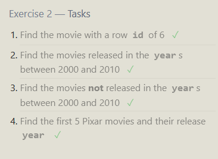
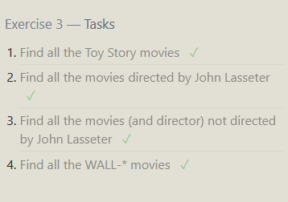
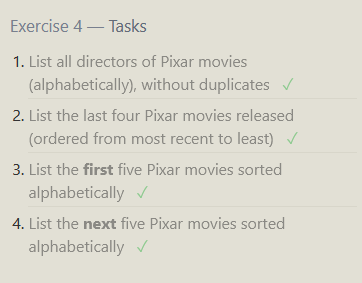
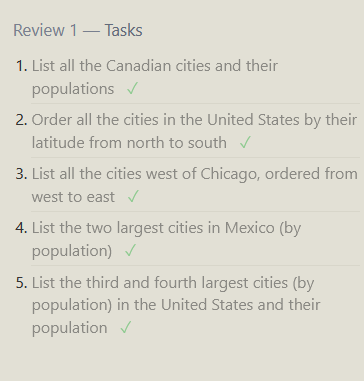
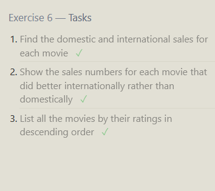
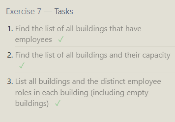
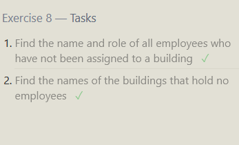
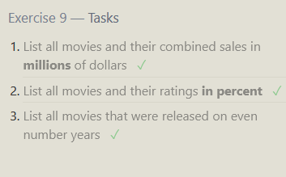
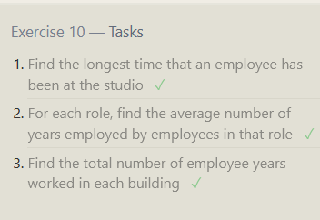
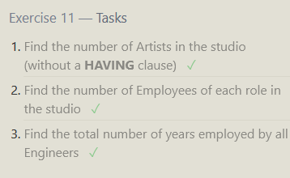
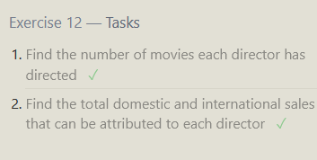
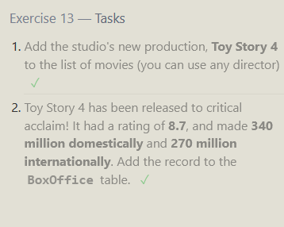
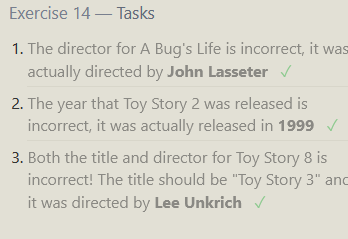
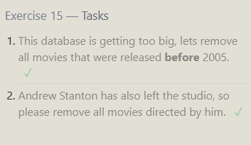
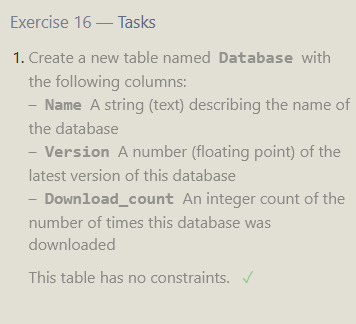
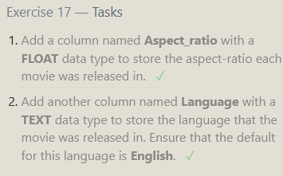
